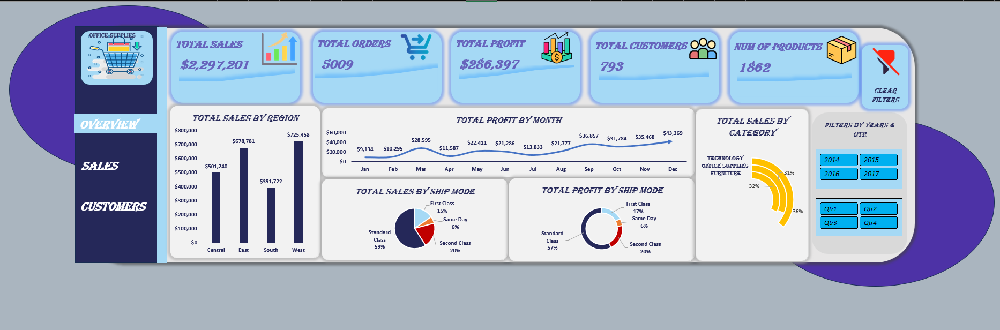
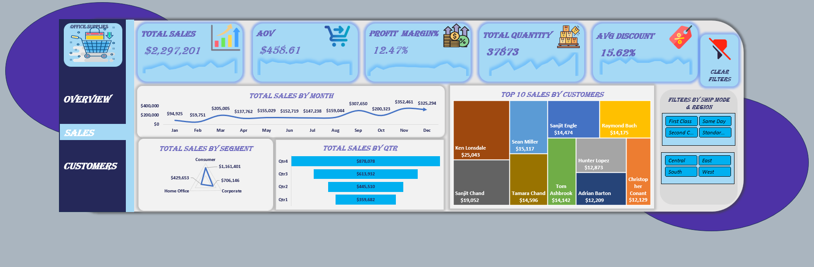
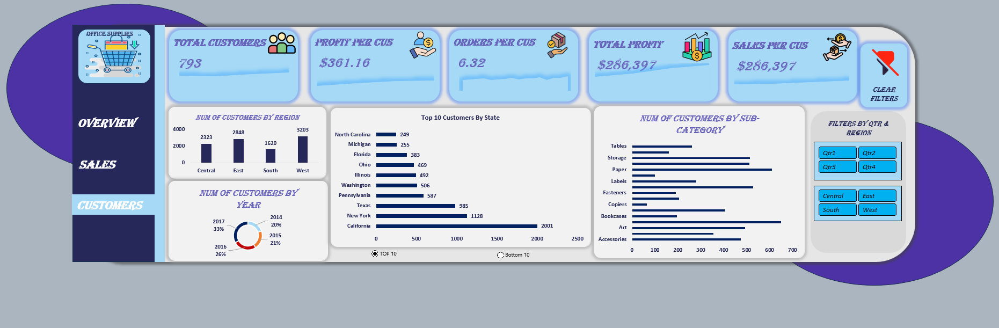

# 📊 Sales & Customer Analytics Dashboard (Excel)

An interactive **multi-page Excel dashboard** built to analyze sales performance, profitability, and customer behavior using transactional sales data.

The project demonstrates an end-to-end BI workflow—from **data preparation and transformation** to **data modeling, DAX calculations, KPI development, and interactive dashboard design** using Microsoft Excel.

---

# 📷 Dashboard Preview

## 🏠 Overview Dashboard



**Overview of business performance including:**
- Total Orders
- Total Sales
- Total Profit
- Total Customers
- Number of Products
- Profit Margin
- Overall Business KPIs

---

## 💰 Sales Dashboard



Sales analysis including:
- Total Sales
- Sales vs Previous Year
- Sales Performance
- Top & Bottom Performing States
- Sales by Sub-Category
- Quantity Analysis
- Profit Analysis

---

## 👥 Customers Dashboard



Customer analysis including:
- Total Customers
- Customer Order Frequency
- Average Sales per Customer
- Repeat Customer Analysis
- Top 10 Customers
- Bottom 10 Customers
- Customer Performance

---

# 📊 Dataset

The project uses transactional sales data containing information about:

- Orders
- Customers
- Products
- Categories & Sub-Categories
- Sales
- Quantity
- Discounts
- COGS
- Profit
- Regions
- Shipping information

The original source files used in the project are available in the **Raw-Data** folder.

### 📁 Project Files

- [Raw Data](Raw-Data/Raw%20Data.xlsx)
- [Shipping Cost Data](Raw-Data/Shipping%20Cost%20Sheet.xlsx)

---

# 💡 Business Insights

During the analysis, several business-focused metrics and comparisons were developed, including:

- Total Sales and Total Profit performance
- Profit Margin analysis
- Year-over-Year Sales comparison
- Customer Order Frequency
- Top and Bottom Customers by order frequency
- Sales performance across states
- Product and sub-category performance
- Quantity and discount analysis

---

# 🛠️ Tools & Technologies

## Microsoft Excel

- PivotTables
- PivotCharts
- Dashboard Design
- Slicers
- Interactive Controls
- Conditional Formatting
- Dynamic Array Functions
- XLOOKUP
- KPI Development
- Custom Number Formatting

---

## Power Query

Power Query was used for the **data preparation and transformation stage** before building the analytical model.

Techniques used include:

- Data Cleaning
- Data Transformation
- Filtering
- Split & Merge Columns
- Custom Columns
- Data Type Transformation
- Renaming & Reordering Columns
- Preparing structured data for the Data Model

---

## Power Pivot

Power Pivot was used to build the **Data Model** and manage relationships between the tables.

Techniques used include:

- Data Modeling
- Relationships
- Measures
- Calculated Columns
- Star Schema Concepts
- Reusable analytical calculations

---

## 🗂️ Data Modeling

The project uses a relational **Data Model** instead of relying only on a single flat table.

The model connects the main **Orders** table with supporting tables such as:

- **Return**
- **People**
- **Shipping Cost**

Relationships between the tables allow the dashboard calculations and filters to work consistently across the model.

This approach makes the analysis more scalable and allows reusable measures to be used across multiple dashboard pages.

---

## DAX

Custom **DAX measures** were created in Power Pivot to calculate KPIs and analytical metrics used throughout the dashboards.

Examples include:

```dax
Total Customers = DISTINCTCOUNT(Orders[Customer ID])

Total Orders = DISTINCTCOUNT(Orders[Order ID])

Total Products = DISTINCTCOUNT(Orders[Product ID])

Total Quantity = SUM(Orders[Quantity])

Total Profit = SUM(Orders[Profit])

Profit Margin = DIVIDE([Total Profit], [Total Sales])
```

Additional calculations were used for:

- Total Sales
- Total Profit
- Profit Margin
- Customer analysis
- Order frequency
- Product analysis
- Year-over-Year comparisons
- Dashboard KPIs

---

## Excel Advanced Analysis

In addition to Power Query, Power Pivot, and DAX, the project uses advanced Excel formulas for dynamic analysis, including:

- XLOOKUP
- COUNTIF / COUNTIFS
- SUM / AVERAGE / MAX
- RANK.EQ
- IF / SWITCH
- FILTER
- SORT
- TAKE
- Dynamic Arrays

Dynamic **Top 10 / Bottom 10** analysis was implemented using dynamic array formulas and interactive controls.

---

# ⚙️ VBA Automation

The workbook includes a VBA macro that allows the user to **clear all slicer filters across the dashboard with one click**.

This provides a quick way to return the dashboards to their default unfiltered state.

### VBA Macro

```vb
Sub Clear_All_Slicers()

    Dim sc As SlicerCache

    For Each sc In ThisWorkbook.SlicerCaches
        sc.ClearManualFilter
    Next sc

End Sub
```

The macro loops through all `SlicerCache` objects in the workbook and clears their manual filters.

---

# ✨ Dashboard Features

- Interactive multi-page dashboard
- Overview, Sales, and Customers pages
- KPI Cards
- Interactive Top 10 / Bottom 10 analysis
- Dynamic chart titles
- Year-over-Year analysis
- Customer Order Frequency analysis
- PivotTables & PivotCharts
- Slicers and interactive controls
- Power Query ETL workflow
- Power Pivot Data Model
- DAX Measures
- Dynamic Array calculations
- Business-focused visualizations

---

# 📈 Dashboard Pages

| Page | Description |
|-------|-------------|
| Overview | Executive overview of business performance |
| Sales | Sales, profit, product, and regional analysis |
| Customers | Customer behavior and order frequency analysis |

---

# 📁 Repository Structure

```text
Excel-Sales-Customer-Analytics
│
├── Project
│   └── Excel Project.xlsm
│
├── Raw-Data
│   ├── Raw Data.xlsx
│   └── Shipping Cost Sheet.xlsx
│
├── Icons
│   └── Dashboard icons
│
├── Screenshots
│   ├── Overview.png
│   ├── Sales.png
│   └── Customers.png
│
└── README.md
```

---

# ⚠️ Note

The main workbook is provided as an **Excel Macro-Enabled Workbook (.xlsm)** and contains VBA automation.

The `Clear_All_Slicers` macro is used to clear slicer filters across the dashboard with one click.

If Excel displays a security warning when opening the workbook, review the warning and enable macros/content only if you trust the file and its source.

---

# 💾 Download

You can access the complete Excel project here:

### 📥 [Download Excel Project](Project/Excel%20Project.xlsm)

Open the workbook using **Microsoft Excel** for the full interactive dashboard experience.

---

# 🧠 Skills Demonstrated

- Data Cleaning
- Data Transformation
- ETL
- Data Modeling
- Data Analysis
- KPI Development
- Data Visualization
- Dashboard Design
- Business Intelligence
- Business Analysis
- DAX
- Power Query
- Power Pivot
- Advanced Excel Formulas
- Dynamic Arrays
- PivotTables
- PivotCharts
- Excel Automation

---

# 👨‍💻 Author

**Ahmed Essam**

📧 **Email:** [v9essam@gmail.com](mailto:v9essam@gmail.com)

💼 **LinkedIn:** [Ahmed Essam](https://www.linkedin.com/in/ahmed-essam-b6b20b28b)

🐙 **GitHub:** [Ahmedessam502](https://github.com/Ahmedessam502)

---

## ⭐ If you found this project useful, consider giving it a Star.

